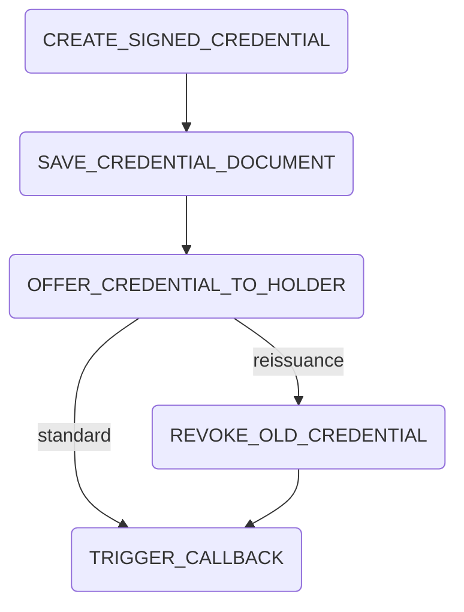

# Create Credential Process

## Summary

The create credential process handles the creation of credentials. The process steps are the following:

## External dependencies

The process worker communicates with the Issuer Wallet to revoke the credential. It further more communicates with the portal backend to create notifications and mails.

## Process Steps

### CREATE_SIGNED_CREDENTIAL

The process step `CREATE_SIGNED_CREDENTIAL` is automatically triggered from the process worker. It calls the issuer wallet to create the requested credential.

### SAVE_CREDENTIAL_DOCUMENT

The process step `SAVE_CREDENTIAL_DOCUMENT` is automatically triggered from the process worker. Calls the issuer wallet to get the created credential to save it in the `documents` table.

### OFFER_CREDENTIAL_TO_HOLDER

The process step `OFFER_CREDENTIAL_TO_HOLDER` is automatically triggered from the process worker. If the wallet address is equal to the issuer wallet this step is skipped. Otherwise the created credential is offered to the holder wallet.

### REVOKE_OLD_CREDENTIAL

The process step `REVOKE_OLD_CREDENTIAL` is automatically triggered from the process worker during a reissuance process (where an `old_credential_id` is present). It revokes the previous version of the credential in the issuer wallet and sets its status to `REVOKED`.

### TRIGGER_CALLBACK

The process step `TRIGGER_CALLBACK` is automatically triggered from the process worker. Posts a callback to the portal with a status of the credential creation.

## Retrigger

| Step Name                    | Retrigger Step                         | Retrigger Endpoint                                                           |
|------------------------------|----------------------------------------|------------------------------------------------------------------------------|
| CREATE_SIGNED_CREDENTIAL     | RETRIGGER_CREATE_SIGNED_CREDENTIAL     | api/issuer/{processId}/retrigger-step/RETRIGGER_CREATE_SIGNED_CREDENTIAL     |
| SAVE_CREDENTIAL_DOCUMENT     | RETRIGGER_SAVE_CREDENTIAL_DOCUMENT     | api/issuer/{processId}/retrigger-step/RETRIGGER_SAVE_CREDENTIAL_DOCUMENT     |
| OFFER_CREDENTIAL_TO_HOLDER | RETRIGGER_OFFER_CREDENTIAL_TO_HOLDER | api/issuer/{processId}/retrigger-step/RETRIGGER_OFFER_CREDENTIAL_TO_HOLDER |
| REVOKE_OLD_CREDENTIAL       | RETRIGGER_REVOKE_OLD_CREDENTIAL       | api/issuer/{processId}/retrigger-step/RETRIGGER_REVOKE_OLD_CREDENTIAL       |
| TRIGGER_CALLBACK             | RETRIGGER_TRIGGER_CALLBACK             | api/issuer/{processId}/retrigger-step/RETRIGGER_TRIGGER_CALLBACK             |

## NOTICE

This work is licensed under the [Apache-2.0](https://www.apache.org/licenses/LICENSE-2.0).

- SPDX-License-Identifier: Apache-2.0
- SPDX-FileCopyrightText: 2024 Contributors to the Eclipse Foundation
- Source URL: https://github.com/eclipse-tractusx/ssi-credential-issuer
