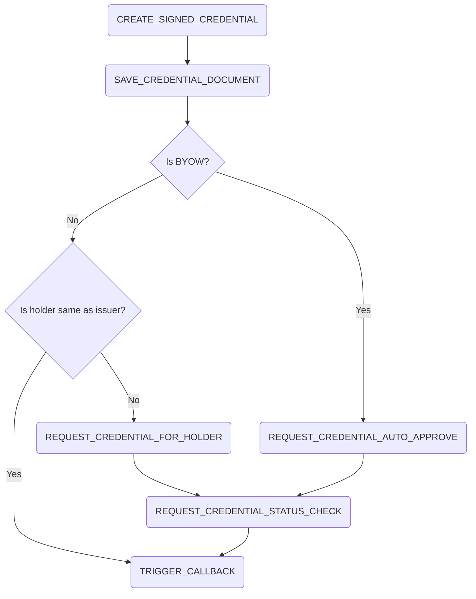

# Create Credential Process

## Summary

The create credential process handles the creation of credentials. The process steps are the following:

## External dependencies

The process worker communicates with the Issuer Wallet to create and sign the credential. It further communicates with the holder's wallet to deliver the credential. It also communicates with the portal backend to create notifications and send status updates via callbacks.

## Process Steps

### CREATE_SIGNED_CREDENTIAL

The process step `CREATE_SIGNED_CREDENTIAL` is automatically triggered from the process worker. It calls the issuer wallet to create the requested credential.

### SAVE_CREDENTIAL_DOCUMENT

The process step `SAVE_CREDENTIAL_DOCUMENT` is automatically triggered from the process worker. Calls the issuer wallet to get the created credential to save it in the `documents` table.

### REQUEST_CREDENTIAL_FOR_HOLDER

The process step `REQUEST_CREDENTIAL_FOR_HOLDER` is automatically triggered from the process worker. If the wallet address is equal to the issuer wallet this step is skipped. Otherwise, a credential request is sent to the holder's wallet. For Bring Your Own Wallet (BYOW) scenarios, this step is also skipped and the process moves to the status check.

### REQUEST_CREDENTIAL_AUTO_APPROVE

The process step `REQUEST_CREDENTIAL_AUTO_APPROVE` is automatically triggered from the process worker. It approves the credential request in the holder's wallet automatically without requiring manual intervention.

### REQUEST_CREDENTIAL_STATUS_CHECK

The process step `REQUEST_CREDENTIAL_STATUS_CHECK` is automatically triggered from the process worker. It checks the status of the credential request in the holder's wallet. If the credential is successfully issued and delivered, the process continues to the callback step. If the delivery failed, it will retry the auto-approve step.

### TRIGGER_CALLBACK

The process step `TRIGGER_CALLBACK` is automatically triggered from the process worker. Posts a callback to the portal with a status of the credential creation.

## Retrigger

| Step Name                       | Retrigger Step                            | Retrigger Endpoint                                                              |
|---------------------------------|-------------------------------------------|--------------------------------------------------------------------------------|
| CREATE_SIGNED_CREDENTIAL        | RETRIGGER_CREATE_SIGNED_CREDENTIAL        | api/issuer/{processId}/retrigger-step/RETRIGGER_CREATE_SIGNED_CREDENTIAL        |
| SAVE_CREDENTIAL_DOCUMENT        | RETRIGGER_SAVE_CREDENTIAL_DOCUMENT        | api/issuer/{processId}/retrigger-step/RETRIGGER_SAVE_CREDENTIAL_DOCUMENT        |
| REQUEST_CREDENTIAL_FOR_HOLDER   | RETRIGGER_REQUEST_CREDENTIAL_FOR_HOLDER   | api/issuer/{processId}/retrigger-step/RETRIGGER_REQUEST_CREDENTIAL_FOR_HOLDER   |
| REQUEST_CREDENTIAL_AUTO_APPROVE | RETRIGGER_REQUEST_CREDENTIAL_AUTO_APPROVE | api/issuer/{processId}/retrigger-step/RETRIGGER_REQUEST_CREDENTIAL_AUTO_APPROVE |
| REQUEST_CREDENTIAL_STATUS_CHECK | RETRIGGER_REQUEST_CREDENTIAL_STATUS_CHECK | api/issuer/{processId}/retrigger-step/RETRIGGER_REQUEST_CREDENTIAL_STATUS_CHECK |
| TRIGGER_CALLBACK                | RETRIGGER_TRIGGER_CALLBACK                | api/issuer/{processId}/retrigger-step/RETRIGGER_TRIGGER_CALLBACK                |

## NOTICE

This work is licensed under the [Apache-2.0](https://www.apache.org/licenses/LICENSE-2.0).

- SPDX-License-Identifier: Apache-2.0
- SPDX-FileCopyrightText: 2024 Contributors to the Eclipse Foundation
- Source URL: https://github.com/eclipse-tractusx/ssi-credential-issuer
