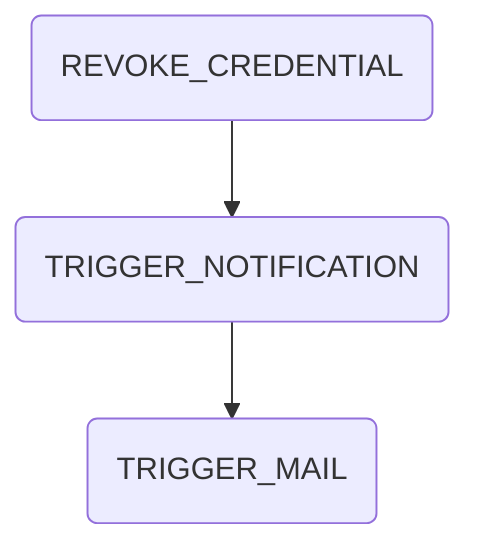

# Delete Credential Process

## Summary

The delete credential process handles the revocation of existing credentials. The process steps are the following:

## External dependencies

The process worker communicates with the Issuer Wallet to revoke the credential. It further more communicates with the portal backend to create notifications and mails.

## Process Steps

### REVOKE_CREDENTIAL

The process step `REVOKE_CREDENTIAL` is automatically triggered from the process worker. It revokes the credential in the wallet and sets the state of the document to inactive and the status of the ssi details to revoked.

### TRIGGER_NOTIFICATION

The process step `TRIGGER_NOTIFICATION` is automatically triggered from the process worker. It will create a notification for the requester of the credential via the portal.

### TRIGGER_MAIL

The process step `TRIGGER_MAIL` is automatically triggered from the process worker. It will create a mail for the requester of the credential via the portal.

## Retrigger

| Step Name            | Retrigger Step                  | Retrigger Endpoint                                                       |
|----------------------|---------------------------------| ------------------------------------------------------------------------ |
| REVOKE_CREDENTIAL    | RETRIGGER_REVOKE_CREDENTIAL     | api/revocation/{processId}/retrigger-step/RETRIGGER_REVOKE_CREDENTIAL    |
| TRIGGER_NOTIFICATION | RETRIGGER_TRIGGER_NOTIFICATION  | api/revocation/{processId}/retrigger-step/RETRIGGER_TRIGGER_NOTIFICATION |
| TRIGGER_MAIL         | RETRIGGER_TRIGGER_MAIL          | api/revocation/{processId}/retrigger-step/RETRIGGER_TRIGGER_MAIL         |

## NOTICE

This work is licensed under the [Apache-2.0](https://www.apache.org/licenses/LICENSE-2.0).

- SPDX-License-Identifier: Apache-2.0
- SPDX-FileCopyrightText: 2024 Contributors to the Eclipse Foundation
- Source URL: https://github.com/eclipse-tractusx/ssi-credential-issuer
