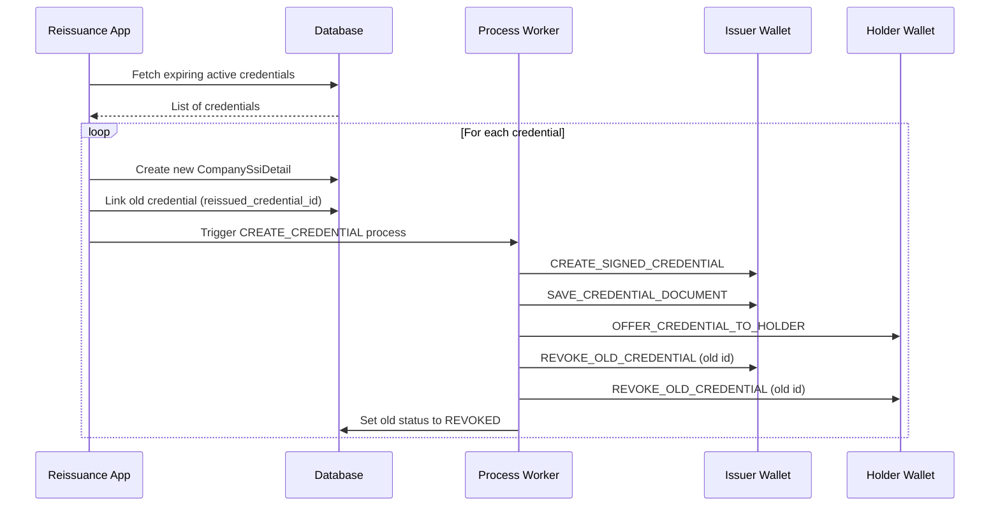

# Reissue Credential Process

## Summary

The reissue credential process is a business feature that automatically handles the reissuance of credentials that are nearing their expiry date. It is implemented as a background service (the Reissuance App) that identifies expiring credentials and initiates a standard `CreateCredential` process for each, while also ensuring the old version is revoked.

The high-level flow is:

1. **Identification**: The Reissuance App identifies active credentials whose `expiry_date` is within a configurable window and have not been reissued yet (`reissued_credential_id` is null).
2. **Initiation**: For each identified credential, it triggers the creation of a new credential using the same data (BPN, Membership details, etc.) and holder information.
3. **Linkage**: The old credential's `reissued_credential_id` is set to the ID of the new credential.
4. **Execution**: The standard [CreateCredential](../processes/01.%20create_credential.md) process runs for the new credential.
5. **Revocation**: As part of the `CreateCredential` process, the step `REVOKE_OLD_CREDENTIAL` is triggered to revoke the old version of the credential in both the issuer and holder wallets.

## Process Flow

## Configuration

The window for reissuance can be configured in the Reissuance App settings:

- `ExpiredVcsToReissueInDays`: The number of days before expiry to start the reissuance process.

## Process Steps (Specific to Reissuance)

While reissuance uses the standard [CreateCredential](../processes/01.%20create_credential.md) steps, the following step is critical for the feature:

### REVOKE_OLD_CREDENTIAL

This step is only executed if the `CompanySsiDetail` has a link to an old credential (identifiable via the `reissued_credential_id` on the old entity). It ensures that once the new credential is successfully offered to the holder, the previous (expiring) version is revoked in the wallet.

## NOTICE

This work is licensed under the [Apache-2.0](https://www.apache.org/licenses/LICENSE-2.0).

- SPDX-License-Identifier: Apache-2.0
- SPDX-FileCopyrightText: 2024 Contributors to the Eclipse Foundation
- Source URL: https://github.com/eclipse-tractusx/ssi-credential-issuer
