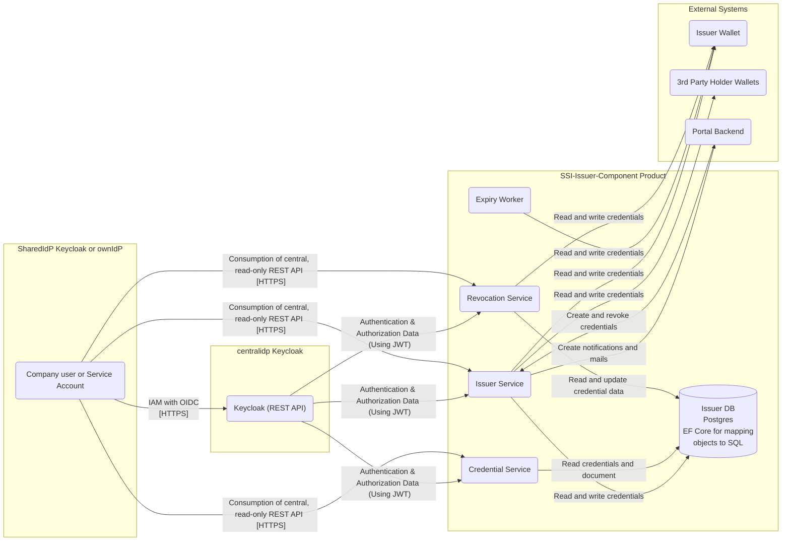

# Security Assessment SSI Credential Issuer

|                           |                                                                                                |
| ------------------------- | ---------------------------------------------------------------------------------------------- |
| Contact for product       | [@evegufy](https://github.com/evegufy)   [@jjeroch](https://github.com/jjeroch)             |
| Security responsible      | tbd |
| Version number of product | 1.0.0                                                                                          |
| Dates of assessment       | tbd: Assessment                                                                      |
| Status of assessment      | Assessment Report                                                                            |

## Product Description

The SSI Credential Issuer product is an REST API project with two Process Worker processes, so a pure backend component (without implementation of an user interface).

The main purpose of the product is to provide authenticated CX Users the possibility to create credentials inside the issuer and holder wallet. Furthermore, it handles the revocation and expiry handling for credentials.

The SSI Credential Issuer comprises the technical foundation for functional interaction, monitoring, auditing and further functionalities.

The product can be run anywhere: it can be deployed as a docker image, e.g. on Kubernetes (platform-independent, cloud, on prem or local).

The SSI Credential Issuer is using following key frameworks:

- .Net
- Entity Framework
[Development Concept](/Development%20Concept.md)

## Data Flow Diagram

### Changes compared to last Security Assessment

N/A

### Features for Upcoming Versions

N/A

## Threats & Risks

TBD

### Mitigated Threats

N/A

### Performed Security Checks

- Static Application Security Testing (SAST) - CodeQL
- Software Composition Analysis (SCA) - Dependabot
- Container Scan conducted - Trivy
- Infrastructure as Code - KICS
- Secret Scanning - GitGuardian
- Dynamic Application Security Testing (DAST) - OWASP ZAP (Unauthenticated)

## NOTICE

This work is licensed under the [Apache-2.0](https://www.apache.org/licenses/LICENSE-2.0).

- SPDX-License-Identifier: Apache-2.0
- SPDX-FileCopyrightText: 2024 Contributors to the Eclipse Foundation
- Source URL: https://github.com/eclipse-tractusx/ssi-credential-issuer
