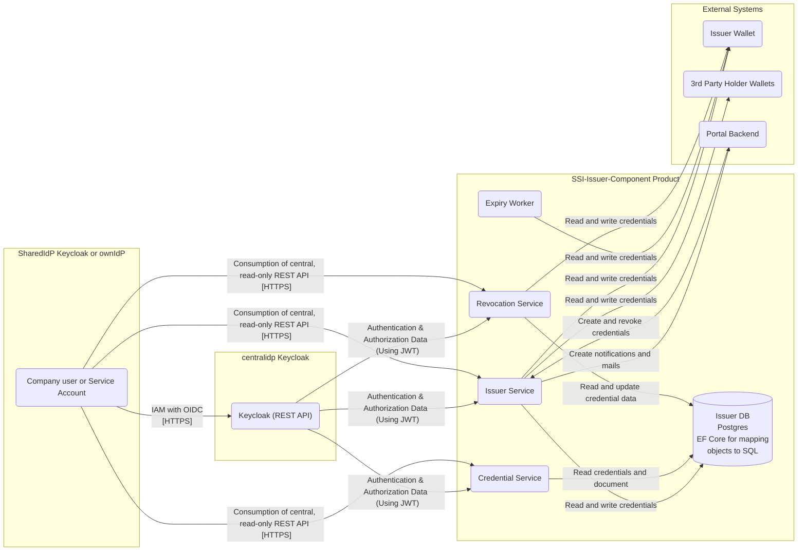

# Security Assessment SSI Credential Issuer

|                           |                                                                                                          |
| :------------------------ | :------------------------------------------------------------------------------------------------------- |
| Contact for product       | [@evegufy](https://github.com/evegufy)   [@jjeroch](https://github.com/jjeroch)                       |
| Security responsible      | [@szymonkowalczykzf](https://github.com/szymonkowalczykzf)   [@pablosec](https://github.com/pablosec) |
| Version number of product | 1.0.0                                                                                                    |
| Dates of assessment       | 2024-05-15: Initial Assessment                                                                           |
| Status of assessment      | DRAFT                                                                                                    |

## Product Description

The SSI Credential Issuer product is a REST API project with two Process Worker processes, so a pure backend component (without implementation of an user interface).

The main purpose of the product is to provide authenticated CX Users the possibility to create credentials inside the issuer and holder wallet. Furthermore, it handles the revocation and expiry handling for credentials.

The SSI Credential Issuer comprises the technical foundation for functional interaction, monitoring, auditing and further functionalities.

The product can be run anywhere: it can be deployed as a docker image, e.g. on Kubernetes (platform-independent, cloud, on prem or local).

The SSI Credential Issuer is using following key frameworks:

- .Net
- Entity Framework

[Development Concept](/Development%20Concept.md)

## Data Flow Diagram

### Additional information:
* The issuer stores the signed credentials in the database for holders to download their own credentials at any time.
  * Unsigned credentials are stored to be compared with signed credentials before providing them to holders
* The signing of credentials is done externally, in the "Issuer Wallet". This application does not hold its own private signing key.
* The issuers DID document is created by Issuer Wallet and published by the Portal itself, not the SSI Credential Issuer application.
* The "Credential Service" can be used by a 3rd party (e.g., certificate holder) to retrieve the status of credential issuance. The "Issuer Service" is used as a starting point for requesting the issuance of a credential.
* Credentials of technical users are encrypted
* All actions are logged within the Issuer DB.

### Changes compared to last Security Assessment

N/A

### Features for Upcoming Versions

N/A

## Threats & Risks

Only low–medium risks were identified during the security assessment:

| 1       | Storage of credentials |
| :------ | :------ |
| Element | Issuer DB |
| Threat  | (Privacy) The storage of credentials of multiple parties makes the SSI Credential Issuer an interesting target for attackers. It should by considered to only store the credentials until they are submitted to the holder. See also [W3C: Verifiable Credentials Data Model v2.0, 8.12 Storage Providers and Data Mining](https://www.w3.org/TR/vc-data-model-2.0/#storage-providers-and-data-mining) and [8.16 Data Theft](https://www.w3.org/TR/vc-data-model-2.0/#data-theft) |

| 2       | Lack of key rotation |
| :------ | :------ |
| Element | Issuer Wallet |
| Threat  | Currently, no key rotation is implemented. While the signing of credentials is done within the "Issuer Wallet", not this product, this application should provide all means for enabling key rotation and push for the implementation of key rotation within the C-X SSI environment. |

| 3       | No technical limitation for batch-revocation of credentials |
| :------ | :------ |
| Element | Revocation Service |
| Threat  | A single person with the appropriate permissions is able to revoke all credentials. Consider the implementation of a two-person rule for critical actions. |

| 4       | Revocation of mismatched credentials |
| :------ | :------ |
| Element | Issuer Service/Revocation Service |
| Threat  | If a difference between the unsigned and signed credential is identified, the credential should be revoked even if it was nerver provided to the holder. (This may be already implemented, the data flow of signing credentials is not outlined clearly in the architecture diagram.)

### Mitigated Threats

N/A

### Performed Security Checks

- Static Application Security Testing (SAST) - CodeQL
- Software Composition Analysis (SCA) - Dependabot
- Container Scan conducted - Trivy
- Infrastructure as Code - KICS
- Secret Scanning - GitGuardian
- Dynamic Application Security Testing (DAST) - OWASP ZAP (Unauthenticated)

## NOTICE

This work is licensed under the [Apache-2.0](https://www.apache.org/licenses/LICENSE-2.0).

- SPDX-License-Identifier: Apache-2.0
- SPDX-FileCopyrightText: 2024 Contributors to the Eclipse Foundation
- Source URL: https://github.com/eclipse-tractusx/ssi-credential-issuer
