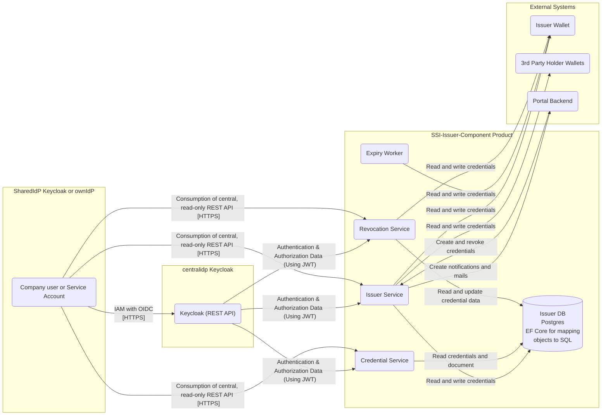

# Security Assessment SSI Credential Issuer

|                           |                                                                                                |
| ------------------------- | ---------------------------------------------------------------------------------------------- |
| Contact for product       | [@evegufy](https://github.com/evegufy)   [@jjeroch](https://github.com/jjeroch)             |
| Security responsible      | tbd |
| Version number of product | 0.1.0                                                                                          |
| Dates of assessment       | tbd: Assessment                                                                      |
| Status of assessment      | Assessment Report                                                                            |

## Product Description

SSI-Credential-Issuer project is an REST API project with two additional Process Worker processes, without implementation of an UI. (Pure Backend Component)

Main purpose of the product is to provide authenticated C-X Users the possibility to create credentials inside the issuer and holder wallet. Furthermore it handles the revocation and expiry handling for credentials.

The SSI-Credential-Issuer comprise the technical foundation for interaction, monitoring, auditing and further functionalities.
They are state of the art in terms of technology portfolio, consist of open-source components whenever possible and are open-sourced themselves 100%.

SSI-Credential-Issuer can be run anywhere: it can be deployed as a docker image, e. g. on Kubernetes (platform-independent, cloud, on prem or local).

The policy hub is using following key frameworks:

- .Net
- Entity Framework
[architecture & development concept](https://github.com/eclipse-tractusx/ssi-credential-issuer/blob/main/docs/technical-documentation/architecture/Development%20Concept.md)

## Data Flow Diagram

### Changes compared to last Security Assessment

N/A

### Features for Upcoming Versions

N/A

## Threats & Risks

All potential threats discussed during the assessment were already mitigated.

### Mitigated Threats

N/A

### Performed Security Checks

- Static Application Security Testing (SAST) - CodeQL
- Dynamic Application Security Testing (DAST) - OWASP ZAP
- Secret Scanning - GitGuardian
- Software Composition Analysis (SCA) - SNYK
- Container Scan conducted - Trivy
- Infrastructure as Code - KICS
- Securing code, dependencies, containers, IaC and Cloud Deployments - SNYK

## NOTICE

This work is licensed under the [Apache-2.0](https://www.apache.org/licenses/LICENSE-2.0).

- SPDX-License-Identifier: Apache-2.0
- SPDX-FileCopyrightText: 2024 Contributors to the Eclipse Foundation
- Source URL: https://github.com/eclipse-tractusx/ssi-credential-issuer
