# Database View

- [Database View](#database-view)
  - [Database Overview](#database-overview)
  - [Database Structure](#database-structure)
    - [Enum Value Tables](#enum-value-tables)
    - [Mapping Tables](#mapping-tables)
    - [Credentials](#credentials)
    - [Process Handling](#process-handling)
  - [NOTICE](#notice)

## Database Overview

```mermaid
erDiagram
    COMPANY_SSI_DETAIL_ASSIGNED_DOCUMENTS {
        uuid document_id PK
        uuid company_ssi_detail_id PK
    }
    COMPANY_SSI_DETAIL_STATUSES {
        integer id PK
        text label
    }
    COMPANY_SSI_DETAILS {
        uuid id PK
        text bpnl
        text issuer_bpn
        integer verified_credential_type_id FK
        integer company_ssi_detail_status_id FK
        timestamp date_created
        text creator_user_id
        timestamp expiry_date
        uuid verified_credential_external_type_detail_version_id FK
        integer expiry_check_type_id FK
        uuid process_id
        uuid external_credential_id
        text credential
        timestamp date_last_changed
        text last_editor_id
    }
    COMPANY_SSI_PROCESS_DATA {
        uuid company_ssi_detail_id PK
        jsonb schema
        integer credential_type_kind_id FK
        text client_id
        bytea client_secret
        bytea initialization_vector
        integer encryption_mode
        text holder_wallet_url
        text callback_url
    }
    DOCUMENT_STATUS {
        integer id PK
        text label
    }
    DOCUMENT_TYPES {
        integer id PK
        text label
    }
    DOCUMENTS {
        uuid id PK
        timestamp date_created
        bytea document_hash
        bytea document_content
        text document_name
        integer media_type_id FK
        integer document_type_id FK
        integer document_status_id FK
        text identity_id
        timestamp date_last_changed
        text last_editor_id
    }
    EXPIRY_CHECK_TYPES {
        integer id PK
        text label
    }
    MEDIA_TYPES {
        integer id PK
        text label
    }
    PROCESS_STEP_STATUSES {
        integer id PK
        text label
    }
    PROCESS_STEP_TYPES {
        integer id PK
        text label
    }
    PROCESS_STEPS {
        uuid id PK
        integer process_step_type_id FK
        integer process_step_status_id FK
        uuid process_id FK
        timestamp date_created
        timestamp date_last_changed
        text message
    }
    PROCESS_TYPES {
        integer id PK
        text label
    }
    PROCESSES {
        uuid id PK
        integer process_type_id FK
        timestamp lock_expiry_date
        uuid version
    }
    USE_CASES {
        uuid id PK
        text name
        text shortname
    }
    VERIFIED_CREDENTIAL_EXTERNAL_TYPE_DETAIL_VERSIONS {
        uuid id PK
        integer verified_credential_external_type_id FK
        text version
        text template
        timestamp valid_from
        timestamp expiry
    }
    VERIFIED_CREDENTIAL_TYPE_ASSIGNED_EXTERNAL_TYPES {
        int verified_credential_type_id PK
        int verified_credential_external_type_id PK
    }
    VERIFIED_CREDENTIAL_EXTERNAL_TYPES {
        integer id PK
        text label
    }
    VERIFIED_CREDENTIAL_TYPE_ASSIGNED_KINDS {
        int verified_credential_type_id PK
        int verified_credential_type_kind_id PK
    }
    VERIFIED_CREDENTIAL_TYPE_ASSIGNED_USE_CASES {
        int verified_credential_type_id PK
        uuid use_case_id PK
    }
    VERIFIED_CREDENTIAL_TYPE_KINDS {
        integer id PK
        text label
    }
    VERIFIED_CREDENTIAL_TYPES {
        integer id PK
        text label
    }
    COMPANY_SSI_DETAIL_ASSIGNED_DOCUMENTS ||--|| COMPANY_SSI_DETAILS : company_ssi_detail_id
    COMPANY_SSI_DETAIL_ASSIGNED_DOCUMENTS ||--|| DOCUMENTS : document_id
    COMPANY_SSI_DETAILS ||--|| VERIFIED_CREDENTIAL_TYPES : verified_credential_type_id
    COMPANY_SSI_DETAILS ||--|| COMPANY_SSI_DETAIL_STATUSES : company_ssi_detail_status_id
    COMPANY_SSI_DETAILS ||--|| VERIFIED_CREDENTIAL_EXTERNAL_TYPE_DETAIL_VERSIONS : verified_credential_external_type_detail_version_id
    COMPANY_SSI_DETAILS ||--|| EXPIRY_CHECK_TYPES : expiry_check_type_id
    COMPANY_SSI_DETAILS ||--|| PROCESSES : process_id
    COMPANY_SSI_PROCESS_DATA ||--|| COMPANY_SSI_DETAILS : company_ssi_detail_id
    COMPANY_SSI_PROCESS_DATA ||--|| VERIFIED_CREDENTIAL_TYPE_KINDS : credential_type_kind_id
    DOCUMENTS ||--|| DOCUMENT_STATUS : document_status_id
    DOCUMENTS ||--|| DOCUMENT_TYPES : document_type_id
    PROCESS_STEPS ||--|| PROCESS_STEP_STATUSES : process_step_status_id
    PROCESS_STEPS ||--|| PROCESS_STEP_TYPES : process_step_type_id
    PROCESS_STEPS ||--|| PROCESSES : process_id
    PROCESSES ||--|| PROCESS_TYPES : process_type_id
    VERIFIED_CREDENTIAL_EXTERNAL_TYPE_DETAIL_VERSIONS ||--|| VERIFIED_CREDENTIAL_EXTERNAL_TYPES : verified_credential_external_type_id
    VERIFIED_CREDENTIAL_TYPE_ASSIGNED_EXTERNAL_TYPES ||--|| VERIFIED_CREDENTIAL_EXTERNAL_TYPES : has
    VERIFIED_CREDENTIAL_TYPE_ASSIGNED_EXTERNAL_TYPES ||--|| VERIFIED_CREDENTIAL_TYPES : has
    VERIFIED_CREDENTIAL_TYPE_ASSIGNED_KINDS ||--|| VERIFIED_CREDENTIAL_TYPES : verified_credential_type_id
    VERIFIED_CREDENTIAL_TYPE_ASSIGNED_KINDS ||--|| VERIFIED_CREDENTIAL_TYPE_KINDS : verified_credential_type_kind_id
    VERIFIED_CREDENTIAL_TYPE_ASSIGNED_USE_CASES ||--|| USE_CASES : use_case_id
    VERIFIED_CREDENTIAL_TYPE_ASSIGNED_USE_CASES ||--|| VERIFIED_CREDENTIAL_TYPES : verified_credential_type_id

```

## Database Structure

The database is organized into several key tables, each serving a specific purpose:

### Enum Value Tables

`company_ssi_detail_status`, `document_status`, `document_types`, `expiry_check_types`, `media_types`, `process_step_statuses`, `process_step_types`, `process_steps`, `process_types`, `verified_credential_external_types`, `verified_credential_type_kinds`, `verified_credential_types` are tables designed to store enum values. They contain an id and label, derived from the backend enums.

### Mapping Tables

`company_ssi_detail_assigned_documents` and `verified_credential_type_assigned_external_types`, `verified_credential_type_assigned_kinds`, `verified_credential_type_assigned_use_cases` are used to map entities.

### Credentials

The `company_ssi_details` table is utilized to safe the credential requests and set their status.

### Process Handling

The tables `processes`, `process_steps` are used for the processing of the credential creation and revocation.

## NOTICE

This work is licensed under the [Apache-2.0](https://www.apache.org/licenses/LICENSE-2.0).

- SPDX-License-Identifier: Apache-2.0
- SPDX-FileCopyrightText: 2024 Contributors to the Eclipse Foundation
- Source URL: https://github.com/eclipse-tractusx/ssi-credential-issuer
